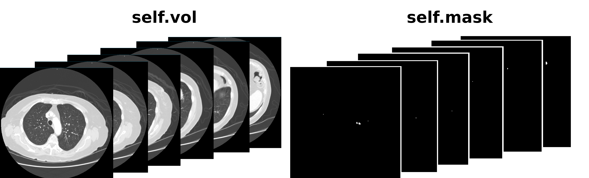
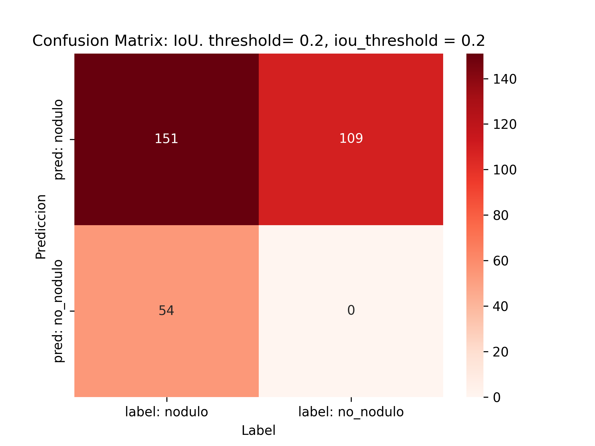
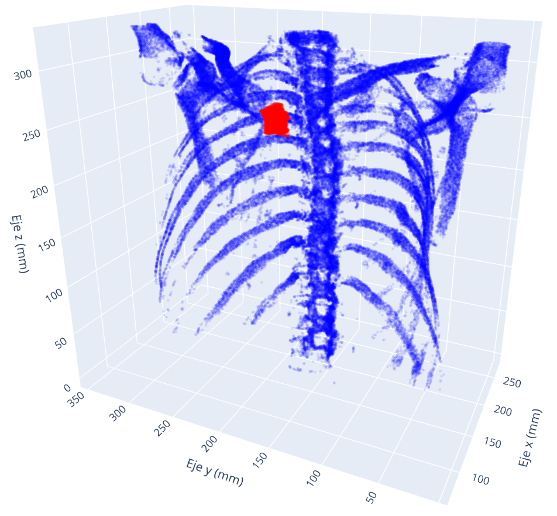
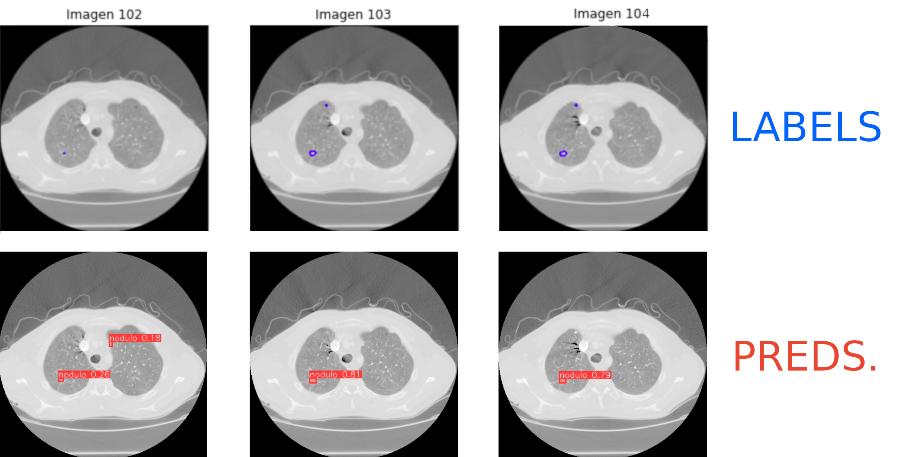

# yolo-lidc
## ¿Qué permite?

- Convertir el dataset LIDC-IDRI (imagenes .dicom + anotaciones de segmentacion de 4 radiologos) a formato YOLO, en contreto para yolov8-segmentation.
- Realizar una validación del modelo obtenido de yolov8-segmentation bajo un criterio de intersection over union, IoU, en 3 dimensiones.




# Usage:  `yolodataset.py`

Revisar el `yolodataset.py`:

```
if __name__ =='__main__':
    path2newdataset='/path/to/new/dataset_yolo'
    path2olddataset = '/path/to/old/LIDC-IDRI_dataset'

    create_dataset(path2olddataset, path2newdataset, val=0.2, percent_include=0.2)
```

Parametros: 
- `val`: porcentaje de pacientes que iran a validation
- `percent_include`: porcentaje de las imagenes que no tienen ningun nodulo etiquetado que serán consideradas.

`/path/to/new/dataset_yolo` debe tener esta pinta:
```
.
├── train
│   ├── images
│   └── labels
├── train.yaml
└── validation
    ├── images
    └── labels
```

y `/path/to/old/LIDC-IDRI_dataset` debe tener esta pinta:
```
.
├── LIDC-IDRI-0002
├── LIDC-IDRI-0005
├── LIDC-IDRI-0013
├── LIDC-IDRI-0055
:
└── LIDC-IDRI-0129
```

Ejecutar:
```
python3 yolodataset.py
```


## ¿Cuál es el formato de YOLO de los datasets?
Las imagenes son guardads en formato `.jpg` siendo cada slice de un TC de un paciente una imagen, guardadas en `images`.

Las etiquetas siguen formato YOLO, es decir, un `.txt` por cada imagen con el mismo nombre las carpetas `labels`. Estas siguen el formato:

`n_clase x1 y1 x2 y2 x3 y3 x4 y4 x5 y5 ...`

Ejemplo: `0 0.324 0.435 0.435 0.5474 0.45754 0.4456 0.45645 0.23462 0.8644 0.23423`

- n_clase = 0 ya que solo hay una clase (yolo es segmentador de instacias)

- xi yi son puntos que perfilan el nodulo en relativo intervalo de valores.(0,1)


Para el dataset LIDC-IDRI se ha elegido el nombre de cada imagen y label con el siguiente criterio:

id_paciente+n_slice

Ejemplo: 
 - Slice numero 143 del paciente con id LIDC-IDRI-0957:
  `LIDC-IDRI-0957_143.png`  y  `LIDC-IDRI-0957_143.txt`

  ```
.
├── train
│   ├── images
│   └── labels
├── train.yaml
└── validation
    ├── images
    └── labels
```

El `train.yaml` incluye:

```
names:
- nodulo

nc: 1

train: ./train/images/
val: ./validation/images/
```


# Usage:  `matrix_3d.py`

Debe ejecutarse el fichero `get_metrics_3d.sh`:

```
./get_metrics_3d.sh
```

Este contiene el comando:

```
python3 matrix_3d.py --val --model "/path/to/model.pt" --save '/path/to/metrics'  --val_path '/path/to/dataset' --threshold 0.3 --iou_threshold 0.2
```

El script `matrix_3d.py` calcula la matriz de confusión teniendo en cuenta la IoU con las etiquetas de los radiólogos.





Todo ello se apoya en el software processLIDC (adaptado a yolo) el cual realiza gestión, carga, preprocesado y visualización del dataset original de LIDC.IDRI:





Yolo realiza predicciones como esta:
